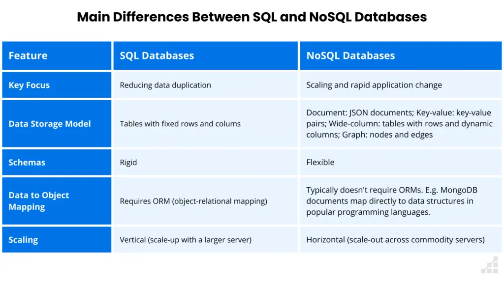
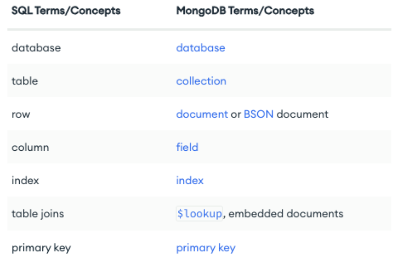
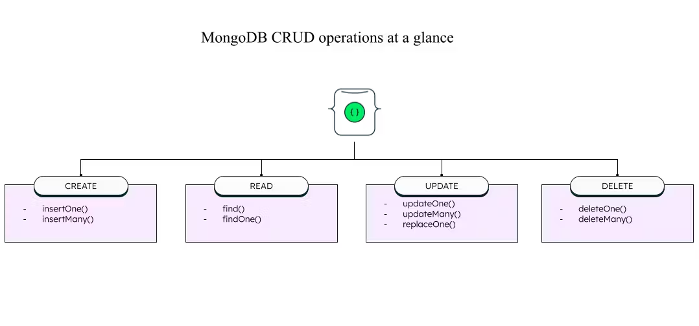

# NoSQL

Apa itu NoSQL? NoSQL adalah sebuah pendekatan baru dalam pengelolaan data yang tidak menggunakan SQL sebagai bahasa query. NoSQL adalah kependekan dari **Not Only SQL**. Jika SQL tipe databasenya hanya satu yaitu kolom & tabel, NoSQL sendiri tipe databasenya ada banyak, diantaranya adalah: 
- Column Family Database, ex : **Apache Cassandra**
- Key Value Database, ex : **Redis**
- Document Database, ex : **MongoDB**
- Graph Database, ex : **Neo 4J**

## Why NoSQL?
- **Flexibility** : NoSQL database tidak memerlukan skema yang ketat, sehingga lebih fleksibel dalam mengelola data.
- **Scalability** : NoSQL database lebih mudah di scale, ada fitur sharding yang memungkinkan data dipecah menjadi beberapa bagian.
- **High-Performance** : NoSQL database biasanya memiliki performa yang lebih baik dibandingkan dengan SQL database.
- **Highly Functional** : NoSQL database memiliki fitur yang lebih lengkap dibandingkan dengan SQL database.

## SQL VS NoSQL


<br>

# MongoDB
Hari ini kita akan belajar database NoSQL yang databaseny berbasis Document. Kita akan menggunakan **MongoDB**, MongoDB adalah salah satu database NoSQL yang paling populer. Dalam MongoDB, data disimpan dalam bentuk dokumen. Dokumen ini menggunakan format JSON, sehingga sangat mudah untuk dibaca dan ditulis.

## Terminologi MongoDB


## Cara menggunakan MongoDB
1. Install MongoDB (https://www.mongodb.com/docs/manual/administration/install-community/)
2. Install MongoSH / MongoDB Compass (Desktop Based Application) or use MongoDB Atlas (Browser Based) untuk tampilannya

## CRUD Operation
[Dokumentasi CRUD MongoDB](https://docs.mongodb.com/manual/crud/)


**Create**
```js
// insert one
db.users.insertOne({
    name: "John Doe",
    age: 25,
    email: "johnDoe@mail.com"
})

// insert many
db.users.insertMany([
    {
        name: "Jane Doe",
        age: 23,
        email: "janeDoe@mail.com"
    },
     {
        name: "Bambang",
        age: 23,
        email: "Bambang@mail.com",
        hobby : "Reading"
    }
])
```

<br>

**Read**
```js
// find all
db.users.find()

// find one with condition, with no condition will return the first data
db.users.findOne({name: "John Doe"})

// find one with condition and projection
db.users.findOne({name: "John Doe"}, {name: 1, email: 1, _id: 0})
```    

<br>

**Update**
```js
// update one
db.users.updateOne({name: "John Doe"}, {$set: {age: 26}})

// update many
db.users.updateMany({age: 23}, {$set: {age: 24}})

// replace one, replace the whole document
db.users.replaceOne({name: "John Doe"}, {name: "John Doe", age: 27, email: "john@mail.com", hobby: "Gaming"})
```

<br>

**Delete**
```js
// delete one
db.users.deleteOne({name: "John Doe"})

// delete many
db.users.deleteMany({age: 24})
```

